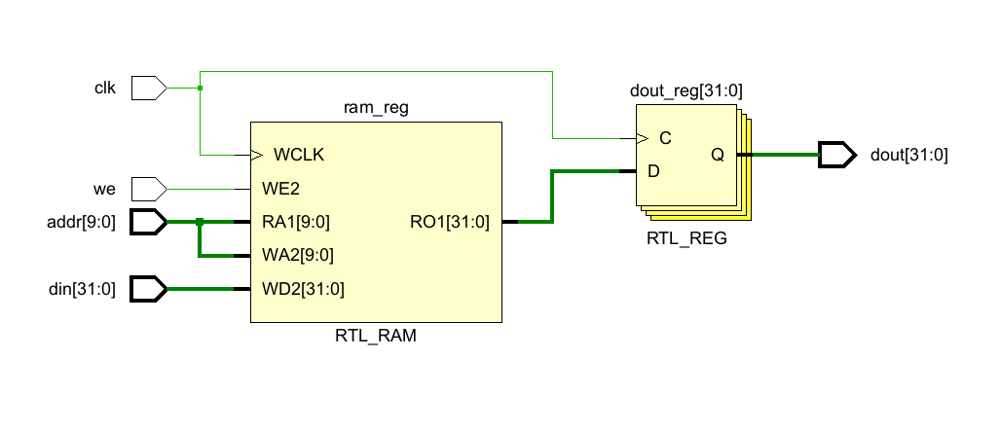

# CODH lab1 report

**张博厚 PB22071354**

## ALU和RF设计
ALU使用组合电路实现, 输入两操作数, 分别对其进行12种运算, 并通过多路选择器输出最终结果(case语句实现).代码如下
```verilog
module ALU#(
    parameter DATA_WIDTH = 32
)(
    input      [DATA_WIDTH-1 : 0]    src0,
    input      [DATA_WIDTH-1 : 0]    src1,
    input      [3  : 0]    op,
    output reg [DATA_WIDTH-1 : 0]    res
);

always @(*) begin
    case (op)
       4'd0: res = src0 + src1;
       4'd1: res = src0 - src1;
       4'd2: res = ($signed(src0)<$signed(src1)) ? 1 : 0;
       4'd3: res = src0 < src1 ? 1 : 0;
       4'd4: res = src0 & src1;
       4'd5: res = src0 | src1;
       4'd6: res = ~(src0 | src1);
       4'd7: res = src0 ^ src1;
       4'd8: res = src0 << src1[4:0];
       4'd9: res = src0 >> src1[4:0];
       4'd10: res = src0 >>> src1[4:0];
       4'd11: res = src1;
    default: res = 32'hFFFF_FFFF;       //多余的四位，res取全1
    endcase
end
endmodule
```
RF异步读取,同步写入,采用写优先, 若we为1且当前要读取的寄存器与待写入寄存器相同(不为x0), 则直接输出wd.
```verilog
module  reg_file # (
    parameter ADDR_WIDTH  = 5,              //地址宽度
    parameter DATA_WIDTH  = 32              //数据宽度
)(
    input                       clk,        //时钟
    input   [ADDR_WIDTH -1:0]   ra0, ra1,   //读地址
    output  [DATA_WIDTH -1:0]   rd0, rd1,   //读数据
    input   [ADDR_WIDTH -1:0]   wa,         //写地址
    input   [DATA_WIDTH -1:0]   wd,         //写数据
    input                       we          //写使能
);
    reg [DATA_WIDTH -1:0]  rf [0:(1<<ADDR_WIDTH)-1];    //寄存器堆

    //读操作：写优先，异步读
    assign rd0 = (wa == ra0 && we && wa != 0) ? wd : rf[ra0];   
    assign rd1 = (wa == ra1 && we && wa != 0) ? wd : rf[ra1];

initial rf[0] = 0;

    //写操作：同步写
    always@ (posedge clk) begin
        if (we && wa != 0)  rf[wa] <= wd;
    end

endmodule
``` 
RTL电路如图所示:


## RAM
分布式存储器的实现方式与RF类似, 区别在于读取与写入均与时钟信号同步, 对于自己的实现的RAM, 可以通过文件读取操作(如$readmemh命令)进行初始化, 对于IP核例化的RAM, 可以通过使用COE文件方式初始化.RTL电路如下:


## SRT
基于分布式存储器实现冒泡排序器, 其中分布式存储器由IP核例化并根据COE文件初始化, 核心实现为一有限状态机, 共有以下7个状态,用三位二进制码表示.
1. WAIT: 等待态, 当未接收到开始排序的start信号时将一直保持此状态.设置变量Sup_index为外层循环的终点, 未开始计时时保持为$1<<ADDR_WIDTH$
2. BEG: 当start为1时, 由WAIT状态转入此状态, 同时此状态为每个内层循环的开始状态. 将读取的地址设为0, 并令Sup_index自减, 进入下一状态.
3. GETD0: 读取到第一个数据, 令地址自增, 准备读取第二个数据.
4. GETD1: 读取到第二个数据, 例化ALU模块进行比较, 若$res[0] ^ up$为1, 则需要表明需要交换, 进入CHAN状态, 否则不需要交换, 比较此时的地址,若达到单次循环的上限(即达到Sup_index),则返回BEG状态, 否则返回GETD0状态.
5. CHAN: 将前后地址中的数据交换, 之后同样判断地址是否达到Sup_index, 来决定返回BEG状态或是GETD0状态.
6. CHECK: 在BEG状态, 若检查到Sup_index为0(即外层循环结束), 即进入此阶段来查看数据, 在此状态内, 输入信号prior和next可分别令地址自减或自增, 从而改变查看的值.由于需要下载测试,为了防止信号采集时间过长, 使用二级寄存器来采集信号上升沿.
此外, 用一reg类型变量count来记录排序所用的时钟周期数.
状态机核心代码如下:
```verilog
always @(posedge clk) begin
    if(!rstn) begin
        count <= 0;
        addr <= 0;
        current_state <= WAIT;
    end
    else begin
        current_state <= next_state;
        case (next_state)
            WAIT: begin 
                Sup_Index <= 1 << ADDR_WIDTH;
            end
            BEG: begin
                cur_index <= 0;
                addr <= 0; 
                count <= count + 1;
                Sup_Index <= Sup_Index - 1;
            end
            GETD0: begin
                cur_index <= cur_index+1;
                data0 <= we ? data0 : dout;       //获取第一个数据
                addr <= cur_index + 1;
                count <= count + 1;
            end
            GETD1: begin
                data1 <= dout;      //获取第二个数据
                //决定要不要交换，此时cur_index保持不变，在后面的组合逻辑中改变we的值
                din <= data0;
                count <= count + 1;
            end
            CHAN: begin
                din <= data1;
                addr <= cur_index - 1;
                count <= count + 1;
            end
            CHECK: begin
                if(prior && (~sub_prior))begin
                    addr <= addr - 1;
                    sub_prior <= prior;
                end
                else if((~prior) && sub_prior)
                    sub_prior <= prior;
                else if(next && (~sub_next))begin
                    addr <= addr + 1;
                    sub_next <= next;
                end
                else if((~next) && sub_next)
                    sub_next <= next;
            end    
        endcase
    end
end

//状态方程
always @(*) begin
    we = 0;
    done = 0;
    case (current_state)
        WAIT: begin
            next_state = start ? BEG : WAIT;
            done = 1;
        end
        BEG:  next_state = (Sup_Index==0) ? CHECK : GETD0;
        GETD0: next_state = GETD1;
        GETD1: begin
            next_state = (comp_res[0] ^ up) ? CHAN : 
                                    (cur_index==Sup_Index ? BEG : GETD0);
            we = comp_res[0] ^ up;
        end
        CHAN:begin
            next_state = (cur_index == Sup_Index) ? BEG : GETD0;
            we = 1;
        end
        CHECK: begin 
            next_state = CHECK;
            done = 1;
        end
    endcase
end
```
RTL电路如下所示:

设计数码管模块, 并和SRT组合成TOP文件,便于下载测试, 添加1输入信号sel, 可以选择显示数据,count值,或者当前数据对应的地址.下载结果已经检查.

## 实验总结
lab1主要是对上学期数电实验内容的复习, 回顾了verilog代码书写,vivado使用,有限状态机设计等内容,总体上难度不大, 在编写时需要特别注意时序逻辑和组合逻辑的区别, 区分阻塞赋值与非阻塞赋值等, 防止出现时序错误.