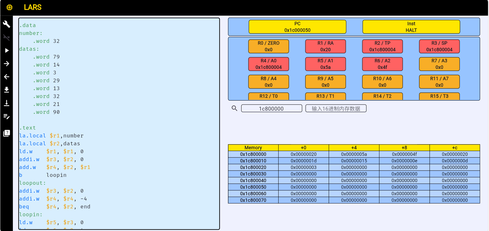

# CODH lab2 report

**张博厚 PB22071354**

## LA32R实现冒泡排序

代码如下:

```
.data
number:
    .word 32
datas:
    .word 79
    .word 14
    .word 3
    .word 29
    .word 13
    .word 32
    .word 21
    .word 90

```
```brightscript
.text
la.local $r1,number     
la.local $r2,datas
ld.w    $r1, $r1, 0
addi.w  $r3, $r2, 0
add.w   $r4, $r2, $r1
b       loopin
loopout:
addi.w  $r3, $r2, 0
addi.w  $r4, $r4, -4
beq     $r4, $r2, end
```
```
loopin:
ld.w    $r5, $r3, 0
ld.w    $r6, $r3, 4
blt     $r5, $r6, change
b       incre
change:
st.w    $r5, $r3, 4
st.w    $r6, $r3, 0
incre:
addi.w  $r3, $r3, 4
beq     $r3, $r4, loopout
b       loopin

end:
halt
```

首先假定数据均为32位格式, 存放在.data段, 同时将数据所占字节数(数据个数*4)也存放在.data段.

在代码段执行冒泡排序过程,  首先将数据个数, 数据首地址分别读取到寄存器r1和r2中, 用r1与r2相加, 得到最后一个数据的地址, 存入r4. 令r4作为外层循环变量, 每次减4; r3作为内层循环变量, 每次从0开始增加, 依次比较相邻元素, 若前者比后者小, 则进行交换, 当r3等于r4时, 当次内循环结束, r4-4, 进入下一个内层循环, 直到r4减小到数据首地址r2为止, 停止运行. 最终结果仍存放在原数据段.

## 结果

{:height="70" width="70%"}

使用LARS平台测试, 数据段从0x1c800004开始, 可见最终成功将数据倒序排列.


## 总结

本次实验较为简单, 主要是学习LA32R指令集的使用, 编写简单的汇编程序, 为后续实验奠定基础.
