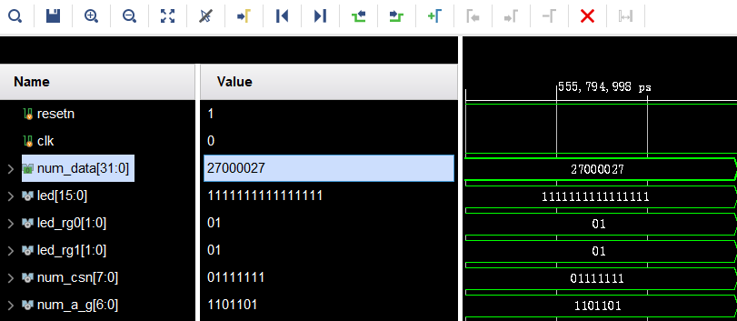
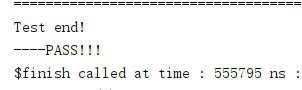
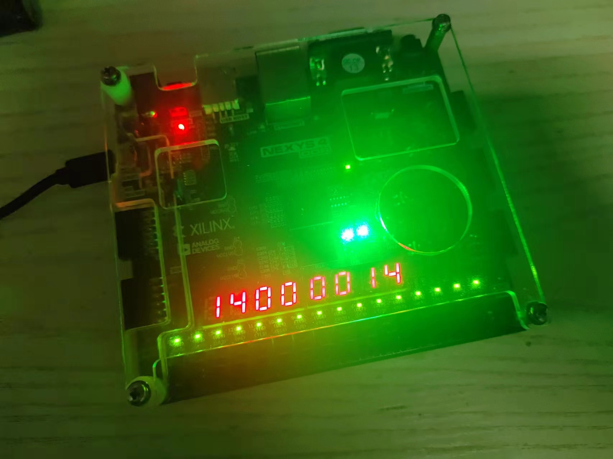

# CODH lab3 report
**张博厚 PB22071354**

## 逻辑设计与核心代码

本实验基于龙芯LoongArch CPU实验exp6, 要求设计实现可执行39条基本整数指令的单周期, 实验可分为两部分, 首先基于实验环境"myCPU_env", 修改其中的"ALU.v"与"mycpu_top.v"文件, 使之具备20条指令功能; 之后在此基础上, 添加剩余的19条整数指令,得到完整的39指令CPU.

### 源文件改错
龙芯实验环境中要求如下: "本实践任务要求：1. 结合本章中讲述的设计方案，阅读并理解mycpu_env/myCPU/目录下提供的代码。 2. 完成代码调试。我们提供的代码中加入了//TODO//处bug，请大家通过仿真波形的调试修复这些bug，使设计可以通过仿真和上板验证。
对代码的调试改错如下:
1. ALU的src1错误, 改为"alu_src1".
2. final_result变量未定义, 添加语句`wire [31 : 0] final_result`.
3. 调试端口中,寄存器写使能端口名称错误, 将"debug_wb_rf_wen"改为"debug_wb_rf_we".
4. ui5产生的逻辑错误, 应为rd.
5. 寄存器写使能信号gr_we产生逻辑错误, 因为bl指令需要写回, 因此将`& ~inst_bl`删去.
6. alu.v中, all与or计算错误, 分别改为`assign sll_result = alu_src1 << alu_src2[4:0];` 和`assign or_result  = alu_src1 | alu_src2;`.
7. alu.v中, sr64_result中alu_src1与alu_src2相反, 且sr_result少了一位, 改为:
   ```verilog
    assign sr64_result = {{32{op_sra & alu_src1[31]}}, alu_src1[31:0]} >> alu_src2[4:0]; 
    assign sr_result   = sr64_result[31:0];
   ```
将上述错误改正之后, 即得到了一个可以运行20条指令的CPU, 此时已经可以正常上板测试.下面为其添加剩余19条指令.

### 添加剩余19条指令

待添加的指令及其译码如下:
```verilog
assign inst_pcaddu12i_w = op_31_26_d[6'h07] & ~inst[25];
assign inst_andi_w      = op_31_26_d[6'h00] & op_25_22_d[4'hd];
assign inst_ori_w       = op_31_26_d[6'h00] & op_25_22_d[4'he];
assign inst_xori_w      = op_31_26_d[6'h00] & op_25_22_d[4'hf];
assign inst_slti_w      = op_31_26_d[6'h00] & op_25_22_d[4'h8];
assign inst_sltui_w     = op_31_26_d[6'h00] & op_25_22_d[4'h9];
assign inst_sll_w       = op_31_26_d[6'h00] & op_25_22_d[4'h0] & op_21_20_d[2'h1] & op_19_15_d[5'h0e];
assign inst_srl_w       = op_31_26_d[6'h00] & op_25_22_d[4'h0] & op_21_20_d[2'h1] & op_19_15_d[5'h0f];
assign inst_sra_w       = op_31_26_d[6'h00] & op_25_22_d[4'h0] & op_21_20_d[2'h1] & op_19_15_d[5'h10];
assign inst_ld_b        = op_31_26_d[6'h0a] & op_25_22_d[4'h0];
assign inst_ld_h        = op_31_26_d[6'h0a] & op_25_22_d[4'h1];
assign inst_st_b        = op_31_26_d[6'h0a] & op_25_22_d[4'h4];
assign inst_st_h        = op_31_26_d[6'h0a] & op_25_22_d[4'h5];
assign inst_ld_bu       = op_31_26_d[6'h0a] & op_25_22_d[4'h8];
assign inst_ld_hu       = op_31_26_d[6'h0a] & op_25_22_d[4'h9];
assign inst_blt         = op_31_26_d[6'h18];
assign inst_bltu        = op_31_26_d[6'h1a];
assign inst_bge         = op_31_26_d[6'h19];
assign inst_bgeu        = op_31_26_d[6'h1b];
```
#### 指令处理
1. pcaddu12i_w: 分别在alu_op[0], need_si20, src1_is_pc, src2_is_imm处添加该指令即可.
2. andi, ori, xori: 分别在对应的alu_op后, src2_is_imm处添加该指令, 新添加变量need_ui_12, 在该3条指令处为1, 修改立即数产生逻辑为:
   ```verilog
   assign imm = src2_is_4 ? 32'h4                      :
             need_si20 ? {i20[19:0], 12'b0}         :
             need_ui5  ? rk                         :
             need_si12 ? {{20{i12[11]}}, i12[11:0]} :
             /*need_ui12*/ {20'h0, i12[11:0]}       ;
   ```
3. sll_w, srl_w, sra_w: 将其添加到对应的alu_op后即可.
4. ld_b/h/bu/hu, st_b/h: 与ld_w, st_w类似, 将这些指令添加到alu_op[0], need_si12, src2_is_imm的产生逻辑中, 此外, 还要将
   ld指令添加到res_from_mem信号后, st指令添加到gr_we和mem_we之后, 修改如下:
   ```verilog
    assign res_from_mem  = inst_ld_w | inst_ld_b | inst_ld_h | inst_ld_bu | inst_ld_hu;
    assign gr_we         = ~inst_st_w & ~inst_st_b & ~inst_st_h & ~inst_beq & ~inst_bne & ~inst_b & ~inst_blt & ~inst_bltu
                        & ~inst_bge & ~inst_bgeu;
    assign mem_we        = inst_st_w | inst_st_b | inst_st_h;
   ```
   特别地, 这些指令涉及到对字节,半字的访问, 产生逻辑将在下一节详述.
5. blt, bltu, bge, bgeu: 创建新变量rj_lt_rd, rj_ltu_rd, 用于判断这四条转移指令的成立条件. 修改br_taken和br_targets:
   ```verilog
    assign rj_lt_rd = ($signed(rj_value) < $signed(rkd_value)); 
    assign rj_ltu_rd = (rj_value < rkd_value);

    assign br_taken = (   inst_beq  &&  rj_eq_rd
                   || inst_bne  && !rj_eq_rd
                   || inst_blt  &&  rj_lt_rd
                   || inst_bge  && !rj_lt_rd
                   || inst_bltu &&  rj_ltu_rd
                   || inst_bgeu && !rj_ltu_rd
                   || inst_jirl
                   || inst_bl
                   || inst_b
                  ) && valid;
    assign br_target = (inst_beq || inst_bne || inst_blt || inst_bge || inst_bltu || inst_bgeu || inst_bl || inst_b) ? (pc + br_offs) :
                                                   /*inst_jirl*/ (rj_value + jirl_offs);
   ```

#### 对字节,半字的处理
添加新模块memMask, 用于处理*.h/.b/.bu/.hu的情形.代码如下:
```verilog
   module memMask (
      input           [31 : 0] invalue,
      input           [1 : 0]  mem_sel,
      input           [3 : 0]  type_sel,
      input                    lors,      //0表示ld, 1表示st
      input           [31 : 0] dm_rdata,
      output  reg     [31 : 0] outvalue                     
   );

   always @(*) begin
      if(!lors) begin
         case (type_sel)
               4'b1000:    //byte
                  outvalue = mem_sel[1] ? (mem_sel[0] ? {{24{invalue[31]}}, invalue[31 : 24]} : {{24{invalue[23]}}, invalue[23 : 16]})
                           : (mem_sel[0] ? {{24{invalue[15]}}, invalue[15 : 8]}  : {{24{invalue[7]}}, invalue[7 : 0]});
               4'b0100:    //halfword
                  outvalue = (mem_sel == 2'b00 || mem_sel == 2'b01) ? {{16{invalue[15]}}, invalue[15 : 0]}
                              : {{16{invalue[31]}}, invalue[31 : 16]} ;
               4'b0010:    //unsigned byte
                  outvalue = mem_sel[1] ? (mem_sel[0] ? {24'h0, invalue[31 : 24]} : {24'h0, invalue[23 : 16]})
                           : (mem_sel[0] ? {24'h0, invalue[15 : 8]}  : {24'h0, invalue[7 : 0]});
               4'b0001:   //unsigned halfword
                  outvalue = (mem_sel == 2'b00 || mem_sel == 2'b01) ? {16'h0, invalue[15 : 0]}
                           : {16'h0, invalue[31 : 16]} ;
               default: outvalue = invalue;
         endcase
      end
      else begin
         case (type_sel)
               4'b1000:  begin
                  case (mem_sel)
                     2'b00:  outvalue = {dm_rdata[31 : 8], invalue[7 : 0]};
                     2'b01:  outvalue = {dm_rdata[31 :16], invalue[7 : 0], dm_rdata[7:0]};
                     2'b10:  outvalue = {dm_rdata[31 :24], invalue[7 : 0], dm_rdata[15: 0]};
                     2'b11:  outvalue = {invalue[7 : 0], dm_rdata[23: 0]};
                  endcase
               end
               4'b0100:    //halfword
                  outvalue = (mem_sel == 2'b00 || mem_sel == 2'b01) ? {dm_rdata[31:16], invalue[15 : 0]}
                              : {invalue[15 : 0], dm_rdata[15:0]} ;
               default: outvalue = invalue;
         endcase
      end
   end
      
   endmodule
```
其中invalue为输入数据, mem_sel为地址低两位,可以进行字节/半字的选择, type_sel用独热的方式标志b, h, bu, hu四种模式, lors标志其为load指令或store指令, dm_rdata表示该地址原本数据(用于store指令), outvalue为最终输入值.
对于ld指令, 根据其类型和地址低两位值, 选择合适的字节/半字, 并在前面补充符号位或者0作为outvalue; 对于st指令, 若为st_b, 则选出invalue的第一字节, 根据地址低两位的数值, 替换掉dm_rdata中对应的字节, 若为st_h则用第一半字替换掉对应半字.(此处注意都是用第一字节/第一半字替换, debug了好久...).
在mycpu_top中, 添加信号mem_byte/halfword/ubyte/uhalfword, 用于生成上述的type_sel信号.
```verilog
   assign mem_byte = inst_ld_b | inst_st_b;
   assign mem_halfword = inst_ld_h | inst_st_h;
   assign mem_ubyte = inst_ld_bu;
   assign mem_uhalfword = inst_ld_hu;
```

## 实验结果

### 39指令仿真结果
如下:


可见39条指令全部测试成功

### 20指令上板结果


### 排序结果
此结果具有动态性, 难以用图片呈现,在检查中说明.

## 实验总结
此次实验遇到了许多困难, 最开始没有注意到仿真框架里的myCPU框架, 感到无从下手, 最后对着龙芯手册和实验PPT, 对照数据通路, 自己编写了decoder和cpu_top等模块, 虽然能成功运行一些指令, 但是遇到了很多问题, 也难以调试, 几乎绝望. 
最后听取建议, 决定重头再来, 在20条指令基础上重写, 感到豁然开朗, 虽然因此没能按时完成实验检查, 但好在能够准时提交实验报告, 展示自己的修改路径. 更重要的是, 磨练了自己随时从头再来的勇气, 谁还没有做过几次无用功呢?
(但是CODH实验什么时候能有文档啊.....)
